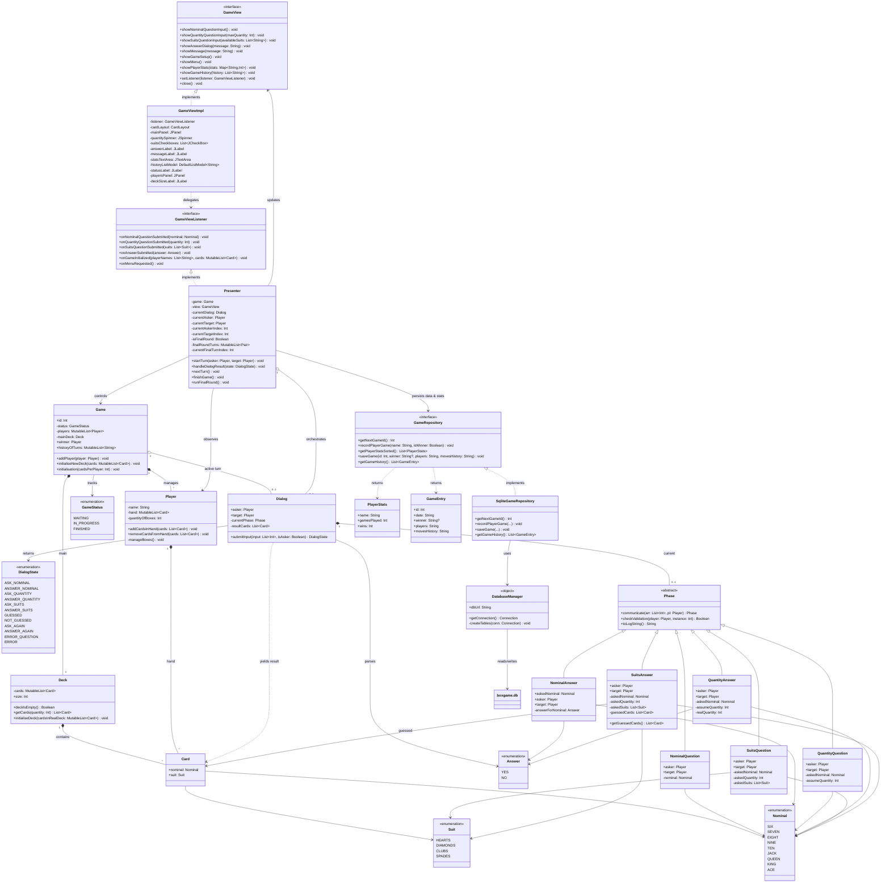

## Администрирование карточной игры "Сундучок" на Kotlin
Десктоп приложение, позволяющее администрировать процесс игры в рамках одной партии

Студент: Кальсина Яна

Правила игры:

Каждому игроку раздается по 4 карты
Игра идет по кругу
Есть закрытая (общая) колода

Ход игрока:
- у него есть карты на руках
- он задает вопрос следующему игроку, есть ли у него карты номинала (который есть в колоде текущего игрока)

- игрок, к которому обращаются, отвечает да или нет
  если нет , то текущий игрок берет карту из общей колоды

- если карты есть, то игрок пытается угадать количество этих карт
- если не угадывает, то берет карту из колоды, игра продолжается
- если угадывает, пытается угадать масти

- пытается угадать масти
- сколько угадал, столько и забрал (например если он назвал даму черви и пики, но у игрока на руках только дама пики, то текущий игрок забирает только даму пики)
- если не угадал, то опять же берется карта из колоды

когда заканчивается общая колода, игроки доигрывают последний круг
и подсчитывают кол-во сундучков у каждого игрока
подсчет идет в конце игры

### Архитектура приложения

#### Диаграммы классов 

## Описание архитектуры

Приложение построено по паттерну **MVP (Model-View-Presenter)** 

### Ключевые компоненты

#### Domain Model (Доменная модель)
Чистый слой, не зависящий от UI. Содержит сущности и правила игры.
- `Card`, `Suit`, `Nominal` – данные карты, масти и номиналы. Чистые data-классы и enum.
- `Player` – управляет рукой игрока. Автоматически подсчитывает собранные сундуки (`quantityOfBoxes`) и удаляет полные наборы из руки.
- `Deck` – управляет колодой: инициализация, раздача, взятие карт (`getCards`).
- `Game` – контейнер состояния игры: список игроков, колода, статус (`GameStatus`), история ходов.

#### Система ходов
Реализована через паттерн **State/Phase**. Каждый шаг хода инкапсулирован в отдельный класс.
- `Phase` – абстрактный базовый класс. Определяет контракт: `communicate()` (обработка ввода), 
- `checkValidation()` (проверка правил), 
- `toLogString()` (лог хода).

- `Dialog` – менеджер фаз. Хранит текущую `Phase`, делегирует ей ввод игрока и возвращает `DialogState` для Presenter.
- Наследники `Phase` (`NominalQuestion`, `QuantityAnswer`, `SuitsAnswer` и др.) – содержат логику конкретного шага, правила валидации и переход к следующей фазе или `null` при завершении хода.
Если игрок не угадывает, то возвращается null, а если null возвращается после фазы AnswerSuits, то проверяется список передаваемых карт и если он не пустой, то это значит, что игрок выиграл

#### Presenter (`Presenter` + `GameViewListener`)
Координатор приложения. Связывает UI и модель.
- `GameViewListener` – интерфейс колбэков от UI.
- `Presenter` – реализует слушатель, управляет жизненным циклом `Game` и `Dialog`, принимает решения (`handleDialogResult`), маршрутизирует ходы (`nextTurn`, `runFinalRound`), обрабатывает условия победы, также добирает карты игрокам, когда возникают какие-то проблемы + определяет кто ходит следующим (тоже зависит от состояния руки игрока)
- При получении нового состояния из Dialog, запрашивает изменения у View (точнее буквально говорит ей что делать)

#### View (`GameView` + `GameViewImpl`)
Swing-интерфейс. Отвечает исключительно за отображение и сбор ввода.
- `GameView` – контракт для UI.
- `GameViewImpl` – реализация на Swing (`CardLayout`, панели, кнопки, спиннеры). Делегирует события в `GameViewListener`. **Не знает про правила игры и модель.**
- немного "тупой" класс, просто знает что и как отрисовывать и на что реагировать. Все action(ы) которые делает пользователь (нажимает на кнопочки) анализирует и в нужном виде отправляет в Presenter

#### DataBase и взаимодействие с ней

Все общение с базой данных происходит через Presenter.

Структура: 

GameRepository (интерфейс) описывает контракт операций с данными.

SqliteGameRepository (реализация интерфейса GameRepository) содержит SQL-запросы и возвращает соответствующие результаты. С его помощью можно:
- получить id след игры
- получить историю игр для отображения во view
- сохранить игру
- получить отсортированную статистику игроков
- обновить игрока в таблице статистики (выиграл он, не выиграл, обновить после того как еще одну игру сыграл)

DatabaseManager он отвечает за подключение к бд и создает таблицы (история игр, статистика игроков).
