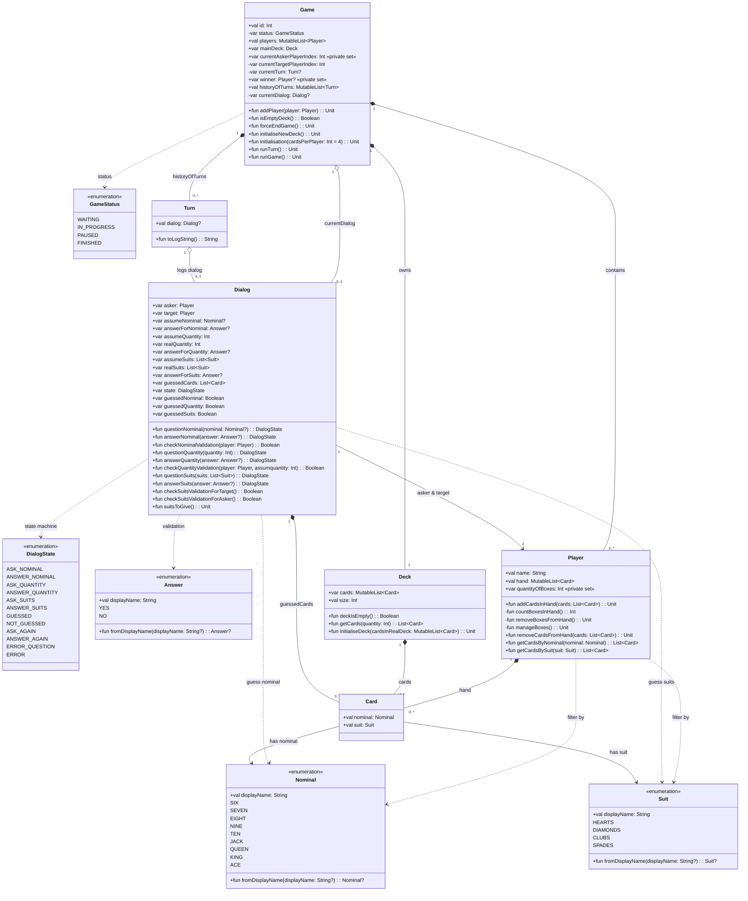

## Администрирование карточной игры "Сундучок" на Kotlin
Десктоп приложение, позволяющее администрировать процесс игры в рамках одной партии

Студент: Кальсина Яна

Правила игры:

Каждому игроку раздается по 4-7 карт
Игра идет по кругу
Есть закрытая (общая) колода

Ход игрока:
- у него есть карты на руках
- он задает вопрос следующему игроку, есть ли у него карты номинала (который есть в колоде текущего игрока)

- игрок, к которому обращаются, отвечает да или нет
  если нет , то текущий игрок берет карту из общей колоды

- если карты есть, то игрок пытается угадать количество этих карт
- если не угадывает, то берет карту из колоды, игра продолжается
- если угадывает, пытается угадать масти

- пытается угадать масти
- сколько угадал, столько и забрал (например если он назвал даму черви и пики, но у игрока на руках только дама пики, то текущий игрок забирает только даму пики)
- если не угадал, то опять же берется карта из колоды

когда заканчивается общая колода, игроки доигрывают последний круг
и подсчитывают кол-во сундучков у каждого игрока
подсчет идет в конце игры

### Архитектура приложения

#### Диаграммы классов 

## Описание архитектуры

### 1. Game — главный управляющий класс
Управляет всей партией: от начала до завершения.

#### Поля
- `id` — идентификатор игры
- `status` — состояние (ожидание, идёт, пауза, завершена)
- `mainDeck: Deck` — основная колода
- `players: List<Player>` — список игроков (меняется редко)
- `currentPlayer: Int` — индекс текущего игрока
- `cardsQuantity` — сколько карт в начале игры
- `currentTurn: Turn` — текущий ход
- `winner` — победитель
- `historyOfTurns: MutableList<Turn>` — история всех ходов

#### Методы
- `isEmptyDeck()` — проверка, не пуста ли колода
- `checkWinCondition()` — проверка победы
- `forceEndGame()` — принудительное завершение (для админа)
- `nextTurn()` — переключение на следующий ход
- `initialisation()` — подготовка игры перед стартом

**Что делает Game:**
- вызывает Turn
- отвечает за смену ходов
- хранит победителя
- в завершении игры от объекта Game собирается статистика

---

### 2. Player — игрок

#### Зачем нужен
Хранит состояние одного игрока.

#### Поля
- `name`
- `hand: MutableList<Card>` — карты на руке
- `quantityOfBoxes` — сколько сундуков заработал

#### Методы
- `countBoxes()` — пересчёт сундуков
- `addCardsInHand(cards, quantity)`
- `removeCardsFromHand(cards, quantity)`

---

### 3. Deck — колода

#### Зачем нужна
Управляет картами в игре.

#### Поля
- `cards: List<Card>` — карты в колоде
- `allCards` — общее количество
- `currentQuantity` — сколько осталось

#### Метод
- `getCard(quantity: Int): List<Card>` — получить N карт (для раздачи или перемещения)
---

## 4. Card — карта

### Поля
- `nominal` — 6,7,8…Ace
- `suit` — масть

---

### 5. Turn — ход (самый важный класс)

- знает, кто спросил
- кто ответил
- какой был вопрос / ответ
- успешен ли ход
- какие карты перемещаются

#### Поля
- `askingPlayer` — кто спросил
- `answeringPlayer` — кого спросили
- `question: Question?`
- `answer: Answer?`
- `isCompleted` — завершён ли ход
- `successful` — успешен (получил сундук или нет)
- `moveCards: MutableList<Card>` — карты, которые перемещаются в ходе

#### Методы (логика хода)
- `checkNominal(q, a)` — совпадает ли номинал
- `checkQuantity(q, a)` — совпадает ли количество
- `checkSuits(q, a)` — проверка мастей
- `isEnoughCards()` — достаточно ли карт у отвечающего
- `getResultFromQuestionAndAnswer()` — итоговый результат хода
- `moveCards(askingPlayer, answeringPlayer, cards)` — перемещение карт

(как только какой-то из методов проверок возвращает false (спрашивающий игрок не
угадал, то successful становится fasle, далее вызывается askingPlayer.getCardFromDeck), если игрок все же 
угадал, то successful становится true, далее вызывается moveCards, внутри которого вызываются методы
обмена картами из класса Player)
---

### 6. Dialog
Поля:
- `nominal`
- `quantity`
- `suits: List<String>`

#### Логика работы Game-Turn-Dialog
Game вызывает метод nextTurn(), 
который в свою очередь создает объект класса Turn

Game создает объект диалога, который заполняется от внешнего взаимодействия (пользователь тыкает на кнопочки)

Что делает Turn:
он хранит историю в письменном виде (кто что спросил, угадал, не угадал, какие карты перешли или же 
была взята какая то (какая?) карта из колоды), game просто передает туда dialog и turn формирует строчку в истории

Сам Dialog только проверяет валидность заданного вопроса и полученного ответа (фильтр на блеф)
и также определяет дальнейшие действия игроков (формирует список карт, которые надо передать) или же
информация о том, что надо взять карту из колоды
