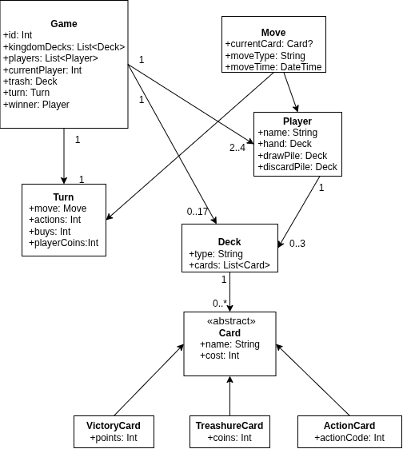
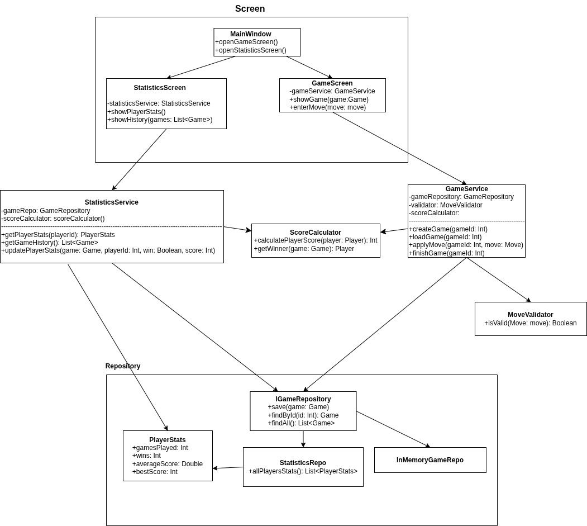

## Администрирование игры Dominion на Kotlin
Десктоп приложение, позволяющее администрировать процесс игры в рамках одной партии

Студент: Кальсина Яна

### Архитектура приложения

#### Предметная диаграмма классов

#### Программная диаграмма классов
